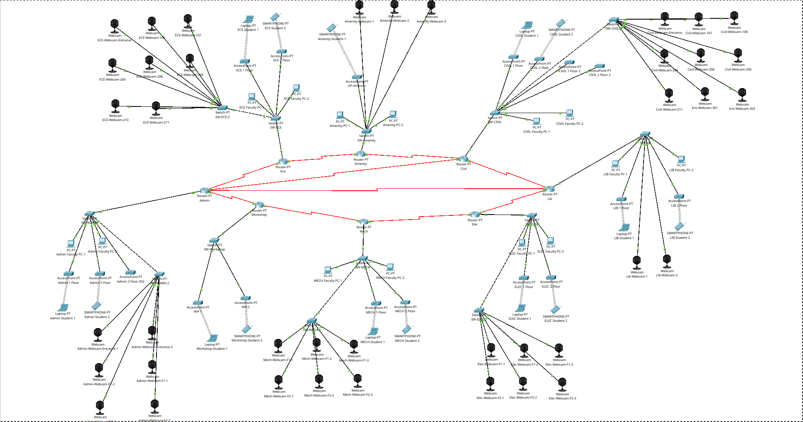

# GEC-SURAT-CAN

**Full Campus Area Network (CAN) for Government Engineering College, Surat**  
*Built with Cisco Packet Tracer*

---

## 📋 Overview

This repository contains a complete, production-ready Campus Area Network simulation for **GEC Surat**, designed in **Cisco Packet Tracer** (`.pkt`). The network interconnects **8 academic departments** across the campus using a multi-router WAN topology with static routing, VLAN-ready switching, and wireless coverage.

> **File:** `GEC_CAN.pkt`  
> **Tool:** Cisco Packet Tracer 7.x / 8.x  
> **Author:** [@krishujeniya](https://github.com/krishujeniya)

---
## 🏛️ Campus Departments

| Department | Router | Local Subnet | Gateway |
|------------|--------|--------------|---------|
| **Admin** | R-Admin | `192.168.1.0/24` | `192.168.1.1` |
| **Workshop** | R-Workshop | `192.168.2.0/24` | `192.168.2.1` |
| **Mechanical** | R-Mech | `192.168.3.0/24` | `192.168.3.1` |
| **Electrical** | R-Elec | `192.168.4.0/24` | `192.168.4.1` |
| **Library** | R-Library | `192.168.5.0/24` | `192.168.5.1` |
| **Civil** | R-Civil | `192.168.6.0/24` | `192.168.6.1` |
| **Amenity** | R-Amenity | `192.168.7.0/24` | `192.168.7.1` |
| **ECE** | R-ECE | `192.168.8.0/24` | `192.168.8.1` |

---

## 🌐 Network Topology



The topology follows a **partial-mesh / ring hybrid** WAN architecture:
- **Serial links** (`10.1.x.0/30`) connect departmental routers via HDLC/PPP.
- **R-Admin** acts as a central aggregation point with multiple direct paths.
- **FastEthernet 0/0** on each router connects to the local departmental switch.
- **Redundant paths** exist between key departments (e.g., Admin↔Library, Civil↔Admin).

---

## 🖥️ End-Device Inventory

### Admin (`192.168.1.0/24`)
| Device | IP | Type |
|--------|-----|------|
| Admin-PC-1 | `192.168.1.2` | Faculty PC |
| Admin-PC-2 | `192.168.1.3` | Faculty PC |
| Admin-Student-1 | `192.168.1.4` | Student PC |
| Admin-Student-2 | `192.168.1.5` | Student PC |
| Admin-Webcam-Entrance-1/2 | `.6`, `.7` | IP Camera |
| Admin-Webcam-F1-1/2 | `.8`, `.9` | IP Camera |
| Admin-Webcam-F2-1/2 | `.10`, `.11` | IP Camera |

### Workshop (`192.168.2.0/24`)
| Device | IP |
|--------|-----|
| Workshop-Student-1 | `192.168.2.4` |
| Workshop-Student-2 | `192.168.2.5` |

### Mechanical (`192.168.3.0/24`)
| Device | IP |
|--------|-----|
| Mech-PC-1 | `192.168.3.2` |
| Mech-PC-2 | `192.168.3.3` |
| Mech-Student-1/2 | `.4`, `.5` |
| Mech-Webcam-F1-1/2/3 | `.6`, `.7`, `.8` |
| Mech-Webcam-F2-1/2/3 | `.9`, `.10`, `.11` |

### Electrical (`192.168.4.0/24`)
| Device | IP |
|--------|-----|
| Elec-PC-1 | `192.168.4.2` |
| Elec-PC-2 | `192.168.4.3` |
| Elec-Student-1/2 | `.4`, `.5` |
| Elec-Webcam-F1-1/2/3 | `.6`, `.7`, `.8` |
| Elec-Webcam-F2-1/2/3 | `.9`, `.10`, `.11` |

### Library (`192.168.5.0/24`)
| Device | IP |
|--------|-----|
| Lib-PC-1/2 | `192.168.5.2`, `.3` |
| Lib-Student-1/2 | `.4`, `.5` |
| Lib-Webcam-1/2 | `.6`, `.7` |

### Civil (`192.168.6.0/24`)
| Device | IP |
|--------|-----|
| Civil-PC-1/2 | `192.168.6.2`, `.3` |
| Civil-Student-1/2 | `.4`, `.5` |
| Civil-Webcam-Entrance | `.6` |
| Civil-Webcam-107/108 | `.7`, `.8` |
| Civil-Webcam-206/208/209/211 | `.9`, `.10`, `.11`, `.12` |
| Env-Webcam-301/303 | `.13`, `.14` |

### Amenity (`192.168.7.0/24`)
| Device | IP |
|--------|-----|
| Amenity-PC-1/2 | `192.168.7.2`, `.3` |
| Amenity-Student-1 | `.4` |
| Amenity-Webcam-1/2/3 | `.5`, `.6`, `.7` |

### ECE (`192.168.8.0/24`)
| Device | IP |
|--------|-----|
| ECE-PC-1/2 | `192.168.8.2`, `.3` |
| ECE-Student-1/2 | `.4`, `.5` |
| ECE-Webcam-Entrance | `.6` |
| ECE-Webcam-106/107 | `.7`, `.8` |
| ECE-Webcam-206/208/209/210/211 | `.9`–`.13` |

---

## 📡 Wireless Access Points

All APs operate on **WPA2-PSK (AES)**.

| AP Name | SSID | Password |
|---------|------|----------|
| Admin-AP-1 | `Admin-1F` | `GEC@admin1` |
| Admin-AP-2 | `Admin-2F` | `GEC@admin2` |
| Admin-AP-3 | `Admin-3F` | `GEC@admin3` |
| Workshop-AP-1 | `Workshop-1F` | `GEC@workshop1` |
| Workshop-AP-2 | `Workshop-2F` | `GEC@workshop2` |
| Mech-AP-1 | `Mech-1F` | `GEC@mech1` |
| Mech-AP-2 | `Mech-2F` | `GEC@mech2` |
| Elec-AP-1 | `Elec-1F` | `GEC@elec1` |
| Elec-AP-2 | `Elec-2F` | `GEC@elec2` |
| Lib-AP-1 | `Lib-1F` | `GEC@lib1` |
| Lib-AP-2 | `Lib-2F` | `GEC@lib2` |
| Civil-AP-1 | `Civil-1F` | `GEC@civil1` |
| Civil-AP-2 | `Civil-2F` | `GEC@civil2` |
| Env-AP-1 | `Env-3F` | `GEC@env1` |
| Env-AP-2 | `Env-3F-2` | `GEC@env2` |
| Amenity-AP-1 | `Amenity-1F` | `GEC@amenity1` |
| ECE-AP-1 | `ECE-1F` | `GEC@ece1` |
| ECE-AP-2 | `ECE-2F` | `GEC@ece2` |

---

## ⚙️ Routing & Configuration

### WAN Link Addressing (Serial /30 Subnets)
| Link | Router A | Router B | Subnet |
|------|----------|----------|--------|
| Admin ↔ Workshop | `10.1.1.1` | `10.1.1.2` | `10.1.1.0/30` |
| Workshop ↔ Mech | `10.1.2.1` | `10.1.2.2` | `10.1.2.0/30` |
| Mech ↔ Elec | `10.1.3.1` | `10.1.3.2` | `10.1.3.0/30` |
| Elec ↔ Library | `10.1.4.1` | `10.1.4.2` | `10.1.4.0/30` |
| Library ↔ Civil | `10.1.5.1` | `10.1.5.2` | `10.1.5.0/30` |
| Civil ↔ Amenity | `10.1.6.1` | `10.1.6.2` | `10.1.6.0/30` |
| Amenity ↔ ECE | `10.1.7.1` | `10.1.7.2` | `10.1.7.0/30` |
| Admin ↔ ECE | `10.1.8.2` | `10.1.8.1` | `10.1.8.0/30` |
| Admin ↔ Civil | `10.1.9.1` | `10.1.9.2` | `10.1.9.0/30` |
| Admin ↔ Library | `10.1.10.1` | `10.1.10.2` | `10.1.10.0/30` |

### Routing Protocol
- **Static Routing** is configured on all 8 routers.
- Every router has full reachability to all 8 LAN subnets via next-hop serial addresses.

### Switching
- **STP (Spanning Tree Protocol)** enabled in **PVST** mode on all switches.
- `SW-Admin` is configured as the **VLAN 1 Root Primary**.
- Router-to-switch uplinks use **FastEthernet 0/0 → FastEthernet 0/1**.

---

## 🚀 How to Use

1. **Clone the repo**
   ```bash
   git clone https://github.com/krishujeniya/GEC-SURAT-CAN.git
   cd GEC-SURAT-CAN
   ```

2. **Open in Cisco Packet Tracer**
   - Launch **Cisco Packet Tracer** (v7.3 or later recommended).
   - Open `GEC_CAN.pkt`.

3. **Verify Connectivity**
   - Enter **Simulation Mode** or use the **Command Prompt** on any PC.
   - Ping across departments, e.g., from an Admin PC (`192.168.1.2`) to an ECE PC (`192.168.8.2`):
     ```cmd
     ping 192.168.8.2
     ```

4. **Inspect Configurations**
   - Click any router → CLI to view running-config.
   - Check `show ip route` to verify static routes.

---

## 🛡️ Security Features

- **WPA2-PSK AES** on all 18 Access Points.
- **Per-department SSID isolation** (no shared SSIDs across departments).
- **Physical segmentation** via dedicated routers and serial WAN links.
- **IP Camera subnets** integrated within departmental LANs for centralized surveillance.

---

## 📦 Requirements

| Software | Version |
|----------|---------|
| Cisco Packet Tracer | 7.3+ / 8.0+ |

---

## 🤝 Contributing

Pull requests are welcome! If you have improvements (e.g., adding OSPF/EIGRP, DHCP pools, NAT, ACLs, or IPv6), feel free to fork and submit a PR.

---

## 📝 License

This project is open-source and available under the [MIT License](LICENSE).

---

**Maintained by [krishujeniya](https://github.com/krishujeniya)**  
*Government Engineering College, Surat*
